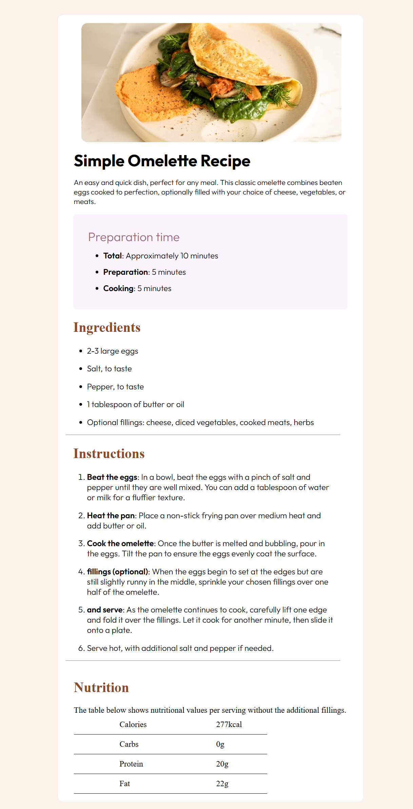
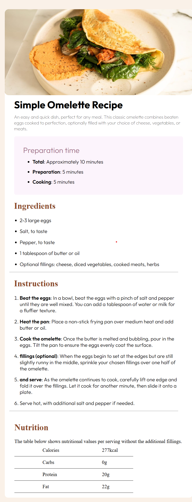

# Frontend Mentor - Recipe page solution

This is a solution to the [Recipe page challenge on Frontend Mentor](https://www.frontendmentor.io/challenges/recipe-page-KiTsR8QQKm). Frontend Mentor challenges help you improve your coding skills by building realistic projects. 

## Overview

### Screenshot

**Note: Delete this note and the paragraphs above when you add your screenshot. If you prefer not to add a screenshot, feel free to remove this entire section.**

### Links

- Solution URL: [Add solution URL here](https://your-solution-url.com)
- Live Site URL: [Add live site URL here](https://your-live-site-url.com)

## My process

### Built with

- Semantic HTML5 markup
 - header tag for introduction and image
  - main for main content
  - ordered and unordered lists
 - section element 
  - headings
- CSS custom properties
- media query
- html tabel

### What I learned
1. margin collapsing
2. font editing

### Continued development
### font designing
1. i want to work on variable fonts .

### Useful resources

- [mozzila](https://developer.mozilla.org/en-US/) - This helped me on fonts variable fonts.

